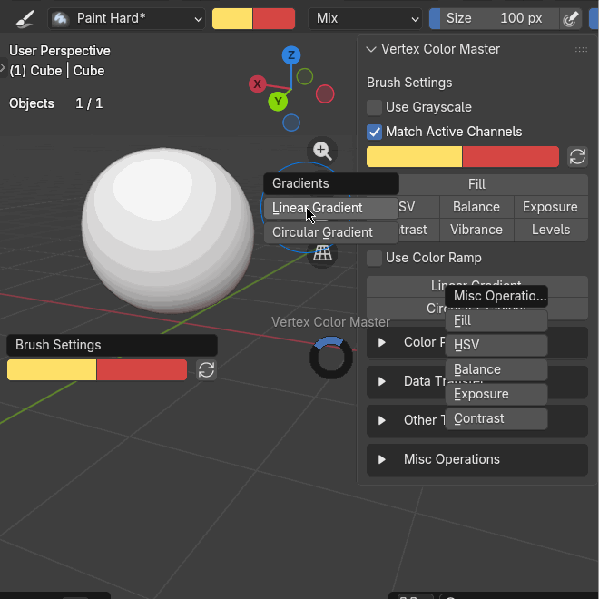
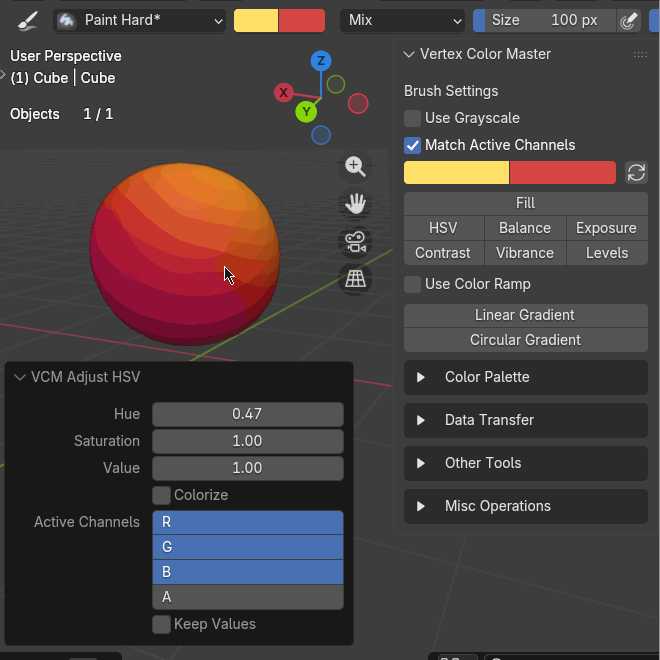
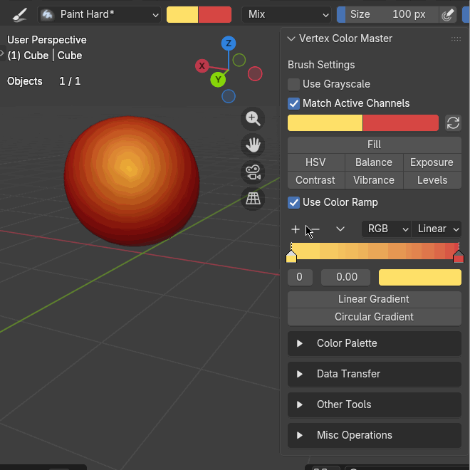
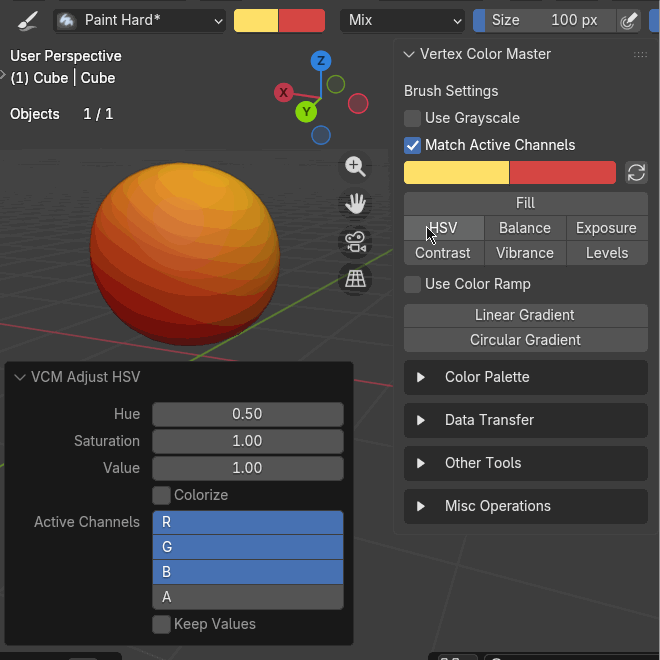

[Eng](README.md) • [Рус](README_ru.md) | [Old README](README_old.md) | [Скачать](https://github.com/theMaxPo/blender_vertex_color_master/releases/latest)

# Vertex Color Master для Blender

Аддон для [Blender](https://www.blender.org/) расширяющий возможности работы с Vertex Colors. Идеально подходит для создания градиентных масок под игровые текстуры и стилизованной раскраски моделей. В [этом видео](https://www.youtube.com/watch?v=-OqRp9o9vQA) хорошо рассказано как можно использовать Vertex Colors в играх.

- [Что умеет](#что-умеет)
- [Установка](#установка)
- [Где и как использовать](#где-и-как-использовать)
- [Примеры использования](#примеры-использования)
- [Лицензия](#лицензия)

## Что умеет

- Линейный и Круговой градиенты.
- Цветокоррекция `HSV`, `Brightness/Contrast`, `Levels`, `Invert` и др.
- Рисовать на каждом канале `RGBA` по отдельности
- и многое другое.

> Я на 100% уверен в работе только тех функций, что указаны выше. Остальное, что было в оригинальном аддоне, может не работать.

## Установка

**Требования:** Blender 5.0 и выше (Должен работать и на более ранних версиях).

1. Скачайте последний релиз со страницы [Releases](https://github.com/theMaxPo/blender_vertex_color_master/releases).
2. Способ 1
   1. Перетащите скачанный .zip файл в открытое окно Blender.
   2. Подтвердите установку расширения.
3. Способ 2
   1. В Blender откройте `Edit` -> `Preferences` -> `Get Extensions` или `Add-ons`.
   2. Справа вверху кновка стрелка вниз `\/` -> `Install from Disk...`.
   3. Выберите скачанный `.zip` архив.
4. Аддон `Vertex Color Master` должен быть включен.

## Где и как использовать

1. Перейдите в режим **Vertex Paint** (`Ctrl+Tab+8`).
2. Интерфейс аддона находится на **Боковой панели (N-Panel) -> вкладка VCM**.
3. Клавиша **`V`** в 3D-окне открывает Pie-меню аддона.

## Примеры использования

### Градиенты и Операции

> Формат .gif искажает качество градиентов, но дает представление о работе инструментов

- **Линейные Градиенты**

- **Круговые градиент**

- **Сложный градиент (3+ цвета)**

- **Цветокоррекция HSV**

### Режим изоляции канала (Isolate Active Channel)

При выборе одного канала (например, Красного `R`), вы можете изолировать его, чтобы работать исключительно в градациях серого. Это невероятно полезно при "упаковке" нескольких масок в один атрибут вершинных цветов (часто используется в геймдеве).

- Нажмите **Isolate Active Channel** для входа в режим.
- Используйте стандартные кисти или инструменты аддона.
- Нажмите **Apply Changes**, чтобы запечь изменения обратно в RGBA слой.

## Лицензия

Этот аддон распространяется по лицензии GPL.

Оригинальный автор: [Andrew Palmer](https://github.com/andyp123).

Оригинальный репозиторий: [Vertex Color Master](https://github.com/andyp123/vertex-color-master).
